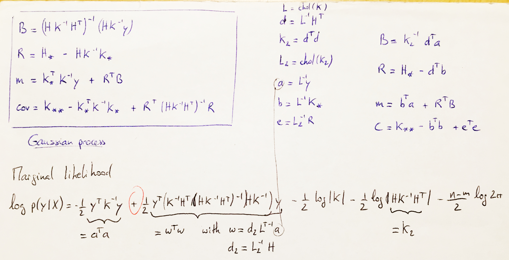

## Cholesky decomposition

$$\mathbf{A} = \mathbf{L}\mathbf{L}^T $$

with $L$ a lower triangular matrix 

## Solving/computing with Cholesky decomposition

### Case 1: $A = LL^T$
Solve $A x = b$ for $x$ knowing that $A = LL^T$,
with $L$ a lower triangular matrix.

$$A x = b \Leftrightarrow L (L^T x) = b$$

We write $\alpha = L^T x$.

1. Solve $L \alpha = b$ for $\alpha$ by forward substitution.
2. Solve $L^T x = \alpha$ for $x$ by backward substitution.

### Case 2: $H^T A^{-1} H$
Compute $H^T A^{-1} H$ knowing that $A = LL^T$, 
with $L$ a lower triangular matrix.

$$
\begin{aligned}
  H^T A^{-1} H &= H^T (LL^T)^{-1} H\\
               &= H^T (L^T)^{-1} L^{-1} H\\
\end{aligned}
$$

with $v = L^{-1}H$

1. Solve $Lv = H$ for $v$ by forward substitution.
2. Compute the crossproduct $v^Tv$.


### Case 3: $K_\star^T K^{-1} y$
Compute $K_\star^T K^{-1} y$ knowing that $K_\star$ and $K$ are positive-definite,
and $K = LL^T$ with $L$ a lower triangular matrix.

$$
\begin{aligned}
K_\star^T K^{-1} y &= K_\star^T (LL^T)^{-1} y\\
                     &= (K_\star^T(L^T)^{-1})(L^{-1} y) \\
                     &= (L^{-1}K_\star)^T(L^{-1} y)\\
                     &=b^T a
\end{aligned}
$$

with $b = L^{-1}K_\star$ and $a = L^{-1}y$

1. Solve $Lb = K_\star$ for $b$ by forward substitution.
2. Solve $La = y$ for $a$ by forward substitution.
3. Compute the cross-product $b^Ta$!


## Predictions and log marginal likelihood for Gaussian process regression

See book of [Rasmussen and Williams (2006)](http://www.gaussianprocess.org/gpml/), chap. 2, page 19.

Predictive mean: $\bar{f_\star} = K_\star^T (K + \sigma^2 I)^{-1}y$

Predictive variance:  $Var(f_\star) = K_{\star\star}^T  - K_\star^T (K + \sigma^2 I)^{-1}K_\star$

Algorithm of Rasmussen and Williams (2006):

1. $L \leftarrow \text{cholesky}(K + \sigma^2 I)$
2. $\alpha \leftarrow L^T\(L\y)$
3. $\bar{f_\star} \leftarrow K_\star^T \alpha$
4. $v \leftarrow L\K_\star$
5. $Var(f_\star) \leftarrow K_{\star\star} - v^T v$
6. $\log(p(y\mid X)) \leftarrow -\frac{1}{2} y^T \alpha - \sum_i \log L_{ii} - \frac{n}{2}\log 2\pi$

Algorithm of GauProMod, file [GPpred.cpp](https://github.com/emanuelhuber/GauProMod/blob/master/src/GPpred.cpp) (note that here we write $K$ for $(K + \sigma^2 I)$):

1. Compute $L$ with the cholesky decomposition, i.e., 
    ```cpp 
    L = K.llt().matrixL());
    ```
2. We compute $b^T = (L^{-1}K_\star)^T$ by solving $L^Tb^T = K_\star^T$ for $b^T$ (see Case 3.1)
    ```cpp 
    bt = (L.triangularView<Lower>().solve(Kstar)).adjoint();
    ```
3. We compute $a = L^{-1}yT$ by solving $La = y$ for $aT$ (see Case 3.2)
    ```cpp 
    a = L.triangularView<Lower>().solve(y);
    ```    
4. We compute the mean of the Gaussian process: $b^Ta = K_\star^T K^{-1}y$
    ```cpp 
    M = bt * a;
    ```      
5. We compute $K_\star^T (K + \sigma^2 I)^{-1}K_\star = v^T v$ (see Case 2)
    ```cpp 
    btb = MatrixXd(kk,kk).setZero().selfadjointView<Lower>().rankUpdate(bt);
    ``` 
6. We compute the covariance of the Gaussian process: $K_{\star\star}^T  - K_\star^T (K + \sigma^2 I)^{-1}K_\star$
    ```cpp 
    C = Kstarstar - vtv;
    ``` 


## Predictions and log marginal likelihood for Gaussian process regression with explicit basis functions

See book of [Rasmussen and Williams (2006)](http://www.gaussianprocess.org/gpml/), chap. 2.7, page 27-29.  

Algorithm of GauProMod, file [GPpredmean.cpp](https://github.com/emanuelhuber/GauProMod/blob/master/src/GPpredmean.cpp):

See my notes...


    
    

## Log determinant of positive definite matrices


<!--
$$\forall x \in R$$
-->
Knowing that:

1. Cholesky decomposition of positive definite matrix $\mathbf{A}$

    $$\mathbf{A} = \mathbf{L}\mathbf{L}^T$$ 

2. determinant of a positive definite matrix $\mathbf{A}$:

    $$
    \begin{aligned}
      \det(\mathbf{A}) &= \det(\mathbf{L}\mathbf{L}^T)\\
              &= \det(\mathbf{L})\det(\mathbf{L}^T)\\
              &= \det(\mathbf{L})^2
    \end{aligned}
    $$


3. log rule

    $$\log \prod_i x_i = \sum_i \log x_i$$
4. determinant of a lower triangular matrix

    $$\det(\mathbf{L}) = \prod_i L_{ii}$$
    
    
the log determinant of positive definite matrices is:

$$
\begin{aligned}    
   \log(\det(\mathbf{A})) &= 2 \log(\det(\mathbf{L}))\\
                          &= 2 \log(\prod_i L_{ii})\\
                          &= 2 \sum_i \log(L_{ii})\\
\end{aligned}
$$


    
Thus to calculate the log determinant of a symmetric positive definite matrix in R:


```r
L <- chol(A)
logdetA <- 2*sum(log(diag(L)))
```

