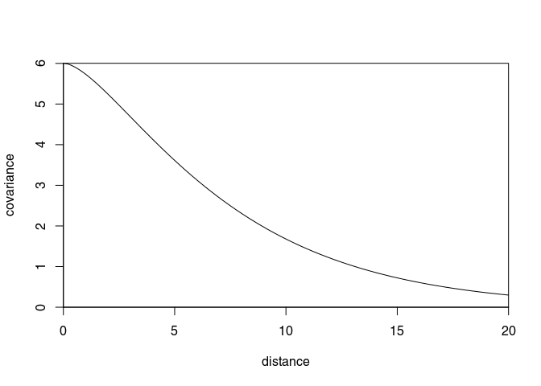
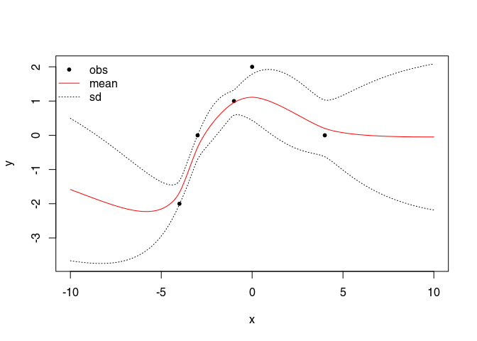
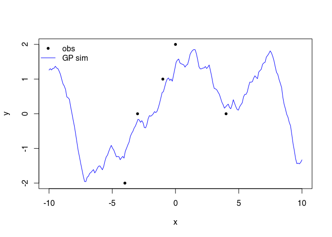
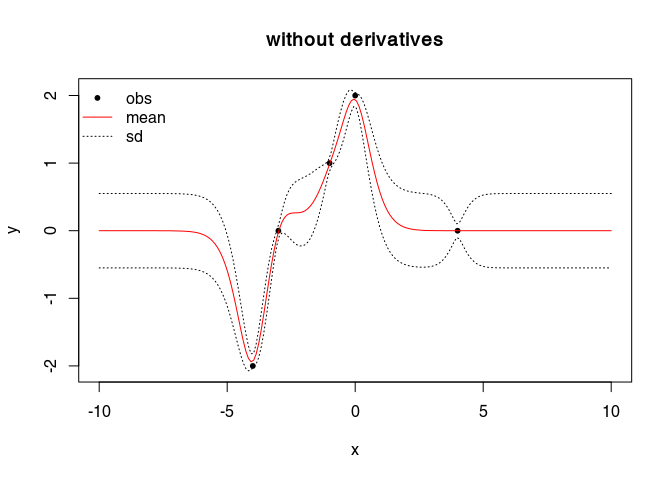
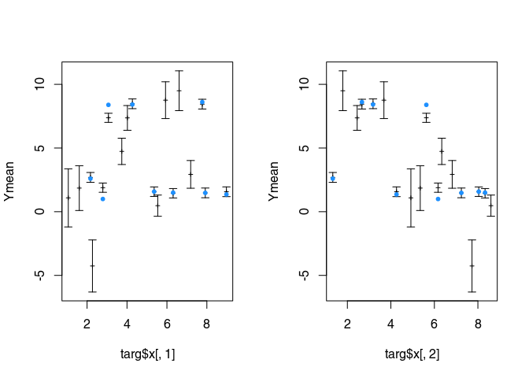
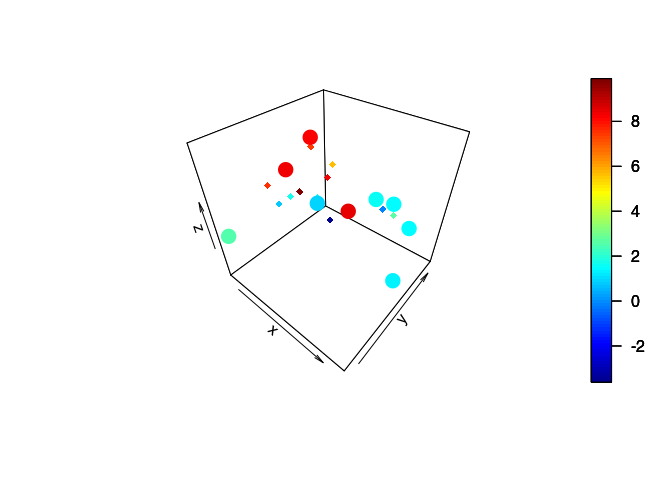
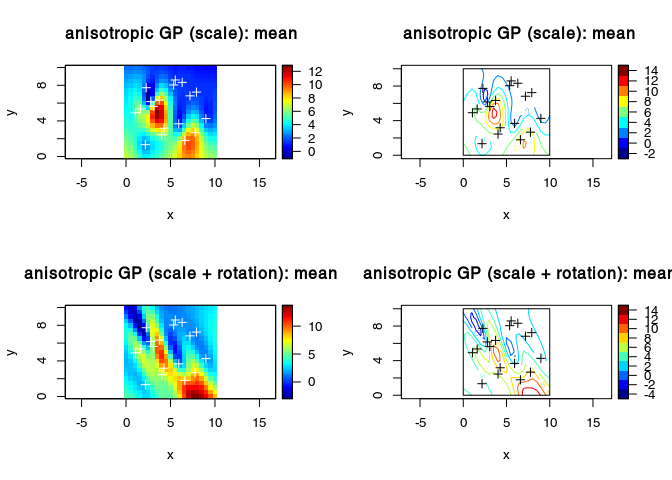
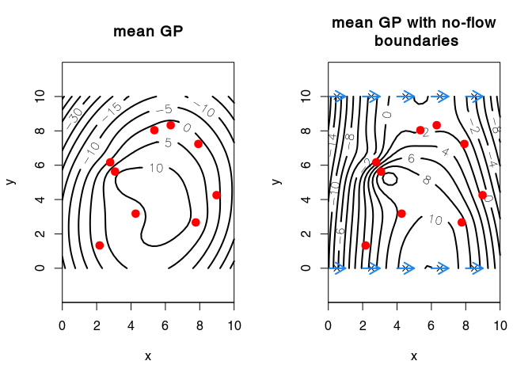
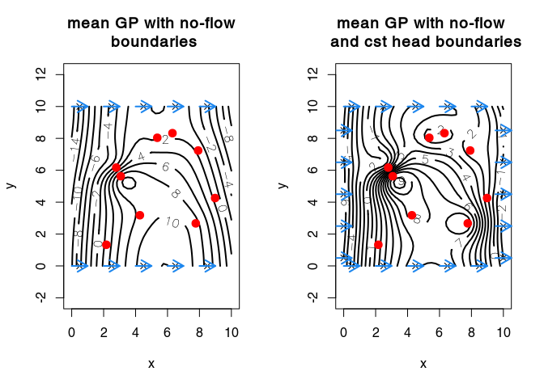
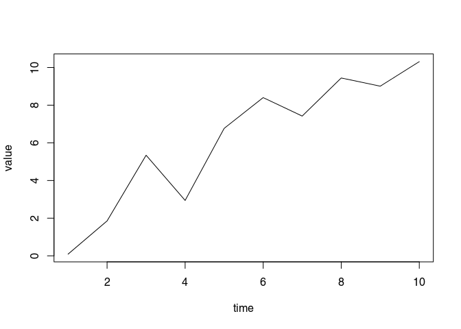

## How to install/load


```r
if(!require("devtools")) install.packages("devtools")
devtools::install_github("emanuelhuber/GauProMod")
```

## Short tutorial
### Load libraries

```r
library(GauProMod)
library(plot3D)
library(RColorBrewer)
```

### 1D Gaussian Process Modelling

#### Observations and  target
The observations are defined by a list with `x` the positions of the 
observations and `y` the observed values. The targets are the positions `x` 
where to simulate the Gaussian Process.


```r
#observations
obs <- list(x=c(-4, -3, -1, 0, 4),
            y=c(-2,  0,  1, 2, 0))
# targets
targ <- list("x"=seq(-10,10,len=200))
```
#### Covariance function, mean function and likelihood
To build the covariance functions, the following kernels are available

```r
# linear kernel
covModel <- list(kernel="linear",
                 b = 1,         # slope
                 h = 1.5,       # std. deviation
                 c = 0)         # constant
                 
# Matern kernel
covModel <- list(kernel="matern",
                 l = 1,       # correlation length
                 v = 2.5,     # smoothness
                 h = 2.45)    # std. deviation

# squared exponential kernel (Gaussian)
covModel <- list(kernel="gaussian",
                 l = 0.5,   # correlation length
                 h = 0.25)  # std. deviation
```

##### Covariance as a function of distance

```r
covModel <- list(kernel="matern",
                 l = 5,     # correlation length
                 v = 1,     # smoothness
                 h = 2.45   # std. deviation
                )
r <- seq(0, 20, by = 0.1)
myCov <- covfx(r = r, covModel = covModel)
plot(r, myCov, type = "l", ylim = c(0, max(myCov)),
     ylab = "covariance", xlab = "distance", xaxs = "i", yaxs = "i")
```

<!-- -->

The following mean function (or basis functions) are available 
(see Rasmussen and Williams (2006), Section 2.7): 


```r
# quadratic mean function
op <- 2
# linear mean function
op <- 1
# zero-mean function (no trend)
op <- 0 
```

Because nothing is perfectly observed, it makes sense to account for uncertainty
in the observation. Gaussian likelihood, defined by the standard deviation 
`sigma` (erreur uncertainty) is the only form of likelihood 
currently implemented in GauProMod.
Sigma must be either a length-one vector or has exactly the same length as the
observations values


```r
# standard deviation measurement error
# Gaussian likelihood
sigma <- 0.2
# or
sigma <- abs(rnorm(length(obs$y)))
```


#### Conditional Gaussian Process modelling


```r
GP <- gpCond(obs = obs, targ = targ, covModels=list(pos=covModel), 
               sigma = sigma, op = op)
names(GP)
# GP$mean   = mean value at location xstar
# GP$cov    = covariance matrix of the conditioned GP
# GP$logLik = log-likelihood of the conditioned GP
# GP$xstar  = x-coordinates at which the GP is simulated
```

Plot the mean function plus/minus the standard deviation


```r
#--- plot mean +/- sd
xp <-(GP$mean + sqrt(diag(GP$cov)))  # mean + sd
xm <-(GP$mean - sqrt(diag(GP$cov)))  # mean - sd

# initialise the plot
plot(cbind(obs$x, obs$y), type="p", xlab="x", ylab="y", 
     xlim = range(c(obs$x, targ$x)), ylim = range(c(xp, xm, obs$y)),
     pch = 20, col = "black") 
lines(GP$xstar, GP$mean,col="red")  # mean
lines(GP$xstar, xm,lty=3)            # + sd
lines(GP$xstar, xp,lty=3)            # - sd
legend("topleft", legend = c("obs", "mean", "sd"), lty = c(NA, 1, 3),
       pch = c(20, NA, NA), col=c("black", "red", "black"), bty="n")
```

<!-- -->
       
Random conditional simulation


```r
# cholesky factorisation
L <- cholfac(GP$cov)
# random simulation
ystar <- gpSim(GP , L = L)
```

You can also directly use `ystar <- gpSim(GP)` without the argument `L` (the
Cholesky factor) but each time you will call `gpSim(GP)`, `gpSim` will 
compute again internally the Cholesky factor. So, if you plan to run many 
unconditional simulations, it is faster to first compute the Cholesky factor
and then run several time `gpSim` with the argument `L`.

Plot the random simulation:

```r
plot(rbind(cbind(obs$x, obs$y), ystar), type="n", xlab="x", ylab="y") 
lines(ystar, col = "blue")
points(cbind(obs$x, obs$y), col = "black", pch = 20)
legend("topleft", legend = c("obs", "GP sim"), lty = c(NA, 1),
       pch = c(20, NA), col=c("black", "blue"), bty="n")
```

<!-- -->


#### Conditional Gaussian Process modelling with derivative observations

We define a new object `bc` (a list) defining the derivative observations, with elements:

- `x` the location of the derivative observations
- `y` the value of the derivative observations
- `sigma` the uncertainty (standard deviation) on the derivative value (`y`)


```r
covModel <- list(kernel = "matern",
                 l = 0.25,
                 v = 3.5,
                 h = 0.55)

bc <- list(x = c(-4.5, -2, 0,  3, 4.5),
           y = c(   0,  1, 0, -1,   0),
           sigma = 0)

sigma <- 0.1

GP <- gpCond(obs = obs, targ = targ, covModels=list(pos=covModel), 
               sigma = sigma, op = 0)
GP2 <- gpCond(obs = obs, targ = targ, covModels=list(pos=covModel), 
               sigma = sigma, op = 0, bc = bc)


#--- plot mean +/- sd
xp <-(GP$mean + sqrt(diag(GP$cov)))  # mean + sd
xm <-(GP$mean - sqrt(diag(GP$cov)))  # mean - sd
xp2 <-(GP2$mean + sqrt(diag(GP2$cov)))  # mean + sd
xm2 <-(GP2$mean - sqrt(diag(GP2$cov)))  # mean - sd


plot(cbind(obs$x, obs$y), type="p", xlab="x", ylab="y", 
     xlim = range(c(obs$x, targ$x)), ylim = range(c(xp, xm, obs$y)),
     pch = 20, col = "black", main = "without derivatives") 
lines(GP$xstar, GP$mean,col="red")  # mean
lines(GP$xstar, xm,lty=3)            # + sd
lines(GP$xstar, xp,lty=3)            # - sd
legend("topleft", legend = c("obs", "mean", "sd"), lty = c(NA, 1, 3),
       pch = c(20, NA, NA), col=c("black", "red", "black"), bty="n")
```

<!-- -->

```r
plot(cbind(obs$x, obs$y), type="p", xlab="x", ylab="y", 
     xlim = range(c(obs$x, targ$x)), ylim = range(c(xp, xm, obs$y)),
     pch = 20, col = "black", main = "with derivatives") 
lines(GP2$xstar, GP2$mean, col = "red")  # mean
lines(GP2$xstar, xm2,lty=3)            # + sd
lines(GP2$xstar, xp2,lty=3)            # - sd
legend("topleft", legend = c("obs", "mean", "sd"), lty = c(NA, 1, 3),
       pch = c(20, NA, NA), col=c("black", "red", "black"), bty="n")
y0 <- GP2$mean[sapply(bc$x, function(x, a) which.min(abs(x - a)), GP2$xstar)]
arrows(x0 = bc$x - 1/2, y0 = y0 - bc$y/2, 
       x1 = bc$x + 1/2, y1 = y0 + bc$y/2,
       length = 0.15, col = "dodgerblue2", lwd = 2)
```

<!-- -->

### Gaussian Process Modelling with two dimensional "positions"

To understand everything, please read the previous section ("1D Gaussian
Process Modelling").

I you want to simulate a Gaussian process on a two-dimensional mesh, go to
the section "2D Gaussian Process Modelling (simulation on a 2D mesh)".

#### Observations and  target
The observations are defined by a list with `x` the positions of the 
observations and `y` the observed values. 
Here, the element `x` of the observation list is a matrix corresponding to
the coordinates of the observations points (East/North coordinates or 
x/y coordinates).


```r
#observations
obs <- list(x = cbind(c(2.17, 7.92, 8.98, 7.77, 2.79, 5.36, 4.27, 3.07, 6.31),
                     c(1.33, 7.24, 4.26, 2.67, 6.17, 8.04, 3.18, 5.63, 8.33)),
            y = c(2.60, 1.48, 1.36, 8.61, 1.00, 1.58, 8.42, 8.39, 1.50))
```

The target is defined by a two-columns matrix corresponding to the
coordinates of the target points.


```r
# targets (=2D mesh)
targ <- list(x = cbind(c(2.17, 7.92, 8.98, 7.77, 2.79, 5.36, 4.27, 3.07, 6.31, 
                       3.74, 5.93, 7.19, 6.61, 5.54, 2.27, 1.61, 4.02, 1.06),
                     c(1.33, 7.24, 4.26, 2.67, 6.17, 8.04, 3.18, 5.63, 8.33,
                       6.34, 3.68, 6.82, 1.79, 8.60, 7.73, 5.35, 2.45, 4.92))
                      )
```

#### Covariance function, mean function and likelihood
To build the covariance functions, the same kernels as in the previously 
defined are available:

```r
# Matern kernel
covModel <- list(kernel="matern",
                 l = 5,     # correlation length
                 v = 1,     # smoothness
                 h = 2.45   # std. deviation
                )
```

Note that the 2D mean functions (or basis functions) are differently defined: 


```r
# 2D quadratic mean function
op <- 5
# zero-mean function (no trend)
op <- 0 
# 2D linear mean function
op <- 2
```

Standard deviation (measurement error):

```r
# Gaussian likelihood
sigma <- 0.2
```


#### Conditional Gaussian Process modelling


```r
GP <- gpCond(obs = obs, targ = targ, covModels=list(pos=covModel), 
               sigma = sigma, op = op)
names(GP)
# GP$mean   = mean value at location xstar
# GP$cov    = covariance matrix of the conditioned GP
# GP$logLik = log-likelihood of the conditioned GP
# GP$xstar  = x-coordinates at which the GP is simulated
```


```r
# mean
Ymean <- GP$mean
# standard deviation
YSD <- sqrt(diag(GP$cov))
ysdplus <- Ymean - 1.95* YSD
ysdminus <- Ymean + 1.95* YSD
```

#### Results
Plot the mean and standard deviation functions

Three-dimensional plot


```r
par(mfrow = c(1,1))
ylim <- range(Ymean, obs$y)
plot3D::scatter3D(x = targ$x[,1], y = targ$x[,2], z = Ymean, clim = ylim, 
                  pch = 20)
plot3D::arrows3D(x0 = targ$x[,1], y0 = targ$x[,2], z0 = ysdminus, 
                 x1 = targ$x[,1], y1 = targ$x[,2], z1 = ysdplus,
                 length=0.05, angle=90, code=3, add = TRUE, col = "black")
# large dots = observations
plot3D::scatter3D(x = obs$x[,1], y = obs$x[,2], z = obs$y, add = TRUE, 
                  pch = 20, cex = 3, clim = ylim)
```

<!-- -->

Pair of two-dimensional plots


```r
par(mfrow = c(1, 2))
ylim <- range(ysdplus, ysdminus, obs$y)

plot(targ$x[,1], Ymean, type = "p", ylim = ylim, pch = 3, cex = 0.5)
arrows(targ$x[,1], ysdminus, targ$x[,1], ysdplus, length=0.05, angle=90, code=3)
points(obs$x[,1], obs$y, col = "dodgerblue", pch = 20)

plot(targ$x[,2], Ymean, type = "p", ylim = ylim, pch = 3, cex = 0.5)
arrows(targ$x[,2], ysdminus, targ$x[,2], ysdplus, length=0.05, angle=90, code=3)
points(obs$x[,2], obs$y, col = "dodgerblue", pch = 20)
```

<!-- -->

#### Random conditional simulation


```r
L <- cholfac(GP$cov)
ystar <- gpSim(GP , L = L)

par(mfrow = c(1,1))
ylim <- range(ystar[,3], obs$y)
plot3D::scatter3D(x = targ$x[,1], y = targ$x[,2], z = ystar[,3], clim = ylim, 
                  pch = 18)
# dots = observations
plot3D::scatter3D(x = obs$x[,1], y = obs$x[,2], z = obs$y, add = TRUE, 
                  pch = 20, cex = 3, clim = ylim)
```

<!-- -->


### 2D Gaussian Process Modelling (simulation on a 2D mesh)
To understand everything, please read the previous section ("1D Gaussian
Process Modelling").

#### Observations and  target
The observations are defined by a list with `x` the positions of the 
observations and `y` the observed values. 
Here, the element `x` of the observation list is a matrix corresponding to
the coordinates of the observations points (East/North coordinates or 
x/y coordinates).


```r
#observations
obs <- list(x = cbind(c(2.17, 7.92, 8.98, 7.77, 2.79, 5.36, 4.27, 3.07, 6.31, 
                       3.74, 5.93, 7.19, 6.61, 5.54, 2.27, 1.61, 4.02, 1.06),
                     c(1.33, 7.24, 4.26, 2.67, 6.17, 8.04, 3.18, 5.63, 8.33,
                       6.34, 3.68, 6.82, 1.79, 8.60, 7.73, 5.35, 2.45, 4.92)),
            y = c(2.60, 1.48, 1.36, 8.61, 1.00, 1.58, 8.42, 8.39, 1.50, 
                  9.05, 1.14, 1.49, 9.19, 1.32, 1.03, 6.41, 6.16, 5.42))
```

The target is defined by a regular grid defined by two orthogonal vectors.
The function `vecGrid`returns a two-columns matrix corresponding to the
coordinates of each element of the grid.


```r
# targets (=2D mesh)
vx <- seq(0, 10, by = 0.5)
vy <- seq(0, 10, by = 0.5)
targ <- list(x = vecGrid(vx, vy))
```

#### Covariance function, mean function and likelihood
To build the covariance functions, the same kernels as in the previously 
defined are available:

```r
# linear kernel
covModel <- list(kernel="linear",
                 b = 1,         # slope
                 h = 0.5,       # std. deviation
                 c = 1)         # constant
                 
# Matern kernel
covModel <- list(kernel="matern",
                 l = 1,       # correlation length
                 v = 2.5,     # smoothness
                 h = 2.45)    # std. deviation

# squared exponential kernel (Gaussian)
covModel <- list(kernel="gaussian",
                 l = 0.5,   # correlation length
                 h = 0.25)  # std. deviation
```

Note that the 2D mean functions (or basis functions) are differently defined: 


```r
# 2D quadratic mean function
op <- 5
# zero-mean function (no trend)
op <- 0 
# 2D linear mean function
op <- 2
```

Standard deviation (measurement error):

```r
# Gaussian likelihood
sigma <- 0.2
```

#### Conditional Gaussian Process modelling


```r
GP <- gpCond(obs = obs, targ = targ, covModels=list(pos=covModel), 
               sigma = sigma, op = op)
names(GP)
# GP$mean   = mean value at location xstar
# GP$cov    = covariance matrix of the conditioned GP
# GP$logLik = log-likelihood of the conditioned GP
# GP$xstar  = x-coordinates at which the GP is simulated
```

Plot the mean and standard deviation functions

```r
# mean
Ymean <- matrix(GP$mean, nrow = length(vx), ncol = length(vy), byrow = TRUE)
# standard deviation
YSD <- matrix(sqrt(diag(GP$cov)), nrow = length(vx), ncol = length(vy), 
              byrow = TRUE)
              
par(mfrow = c(2,2))
plot3D::image2D(x = vx, y = vy, z = Ymean, asp=1)
points(obs$x, col="white",pch=3)
title(main = "mean")

plot3D::contour2D(x = vx, y = vy, Ymean, asp=1)
points(obs$x, col="black",pch=3)
rect(vx[1], vy[1], vx[length(vx)], vy[length(vy)])
title(main = "mean")

plot3D::image2D(x = vx, y = vy, z = YSD, asp=1)
points(obs$x, col="white",pch=3)
title(main = "standard deviation")

plot3D::contour2D(x = vx, y = vy, YSD, asp=1)
points(obs$x, col="black",pch=3)
rect(vx[1], vy[1], vx[length(vx)], vy[length(vy)])
title(main = "standard deviation")
```

<!-- -->

       
Random conditional simulation


```r
L <- cholfac(GP$cov)
ystar <- gpSim(GP , L = L)

Ysim <- matrix(ystar[,3], nrow = length(vx), ncol = length(vy), byrow = TRUE)

par(mfrow=c(1,2))
plot3D::image2D(x = vx, y = vy, z = Ysim, asp=1)
points(obs$x, col="white",pch=3)


plot3D::contour2D(x = vx, y = vy, Ysim, asp=1)
points(obs$x, col="black",pch=3)
rect(vx[1], vy[1], vx[length(vx)], vy[length(vy)])
```

<!-- -->

#### Anisotropy (scaling only along the coordinates axes)


```r
covModelAni <- list(kernel="matern",
                 l = 1,       # correlation length
                 v = 2.5,     # smoothness
                 h = 2.45,
                 scale = c(1, 0.25))    # std. deviation
# 2D linear mean function
op <- 2

GP <- gpCond(obs = obs, targ = targ, covModels=list(pos=covModelAni), 
               sigma = sigma, op = op)
names(GP)
# GP$mean   = mean value at location xstar
# GP$cov    = covariance matrix of the conditioned GP
# GP$logLik = log-likelihood of the conditioned GP
# GP$xstar  = x-coordinates at which the GP is simulated
```

Plot the mean and standard deviation functions

```r
# mean
YmeanAni <- matrix(GP$mean, nrow = length(vx), ncol = length(vy), byrow = TRUE)
# standard deviation
YSDAni <- matrix(sqrt(diag(GP$cov)), nrow = length(vx), ncol = length(vy), 
              byrow = TRUE)
              
par(mfrow = c(2,2))
plot3D::image2D(x = vx, y = vy, z = Ymean, asp = 1)
points(obs$x, col="white",pch=3)
title(main = "isotropic GP: mean ")

plot3D::contour2D(x = vx, y = vy, Ymean, asp = 1)
points(obs$x, col="black",pch=3)
rect(vx[1], vy[1], vx[length(vx)], vy[length(vy)])
title(main = "isotropic GP: mean")

plot3D::image2D(x = vx, y = vy, z = YmeanAni, asp = 1)
points(obs$x, col="white",pch=3)
title(main = "anisotropic GP: mean ")

plot3D::contour2D(x = vx, y = vy, YmeanAni, asp = 1)
points(obs$x, col="black",pch=3)
rect(vx[1], vy[1], vx[length(vx)], vy[length(vy)])
title(main = "anisotropic GP: mean")
```

<!-- -->


#### Anisotropy (scaling and rotation along the coordinates axes)


```r
covModelAni2 <- list(kernel="matern",
                 l = 1,       # correlation length
                 v = 2.5,     # smoothness
                 h = 2.45,
                 scale = c(1, 0.25),
                 rot = c(1.0))    # std. deviation
# 2D linear mean function
op <- 2

GP <- gpCond(obs = obs, targ = targ, covModels=list(pos=covModelAni2), 
               sigma = sigma, op = op)
names(GP)
# GP$mean   = mean value at location xstar
# GP$cov    = covariance matrix of the conditioned GP
# GP$logLik = log-likelihood of the conditioned GP
# GP$xstar  = x-coordinates at which the GP is simulated
```

Plot the mean and standard deviation functions

```r
# mean
YmeanAni2 <- matrix(GP$mean, nrow = length(vx), ncol = length(vy), byrow = TRUE)
# standard deviation
YSDAni2 <- matrix(sqrt(diag(GP$cov)), nrow = length(vx), ncol = length(vy), 
              byrow = TRUE)
              
par(mfrow = c(2,2))
plot3D::image2D(x = vx, y = vy, z = YmeanAni, asp = 1)
points(obs$x, col="white",pch=3)
title(main = "anisotropic GP (scale): mean ")

plot3D::contour2D(x = vx, y = vy, YmeanAni, asp = 1)
points(obs$x, col="black",pch=3)
rect(vx[1], vy[1], vx[length(vx)], vy[length(vy)])
title(main = "anisotropic GP (scale): mean")

plot3D::image2D(x = vx, y = vy, z = YmeanAni2, asp = 1)
points(obs$x, col="white",pch=3)
title(main = "anisotropic GP (scale + rotation): mean ")

plot3D::contour2D(x = vx, y = vy, YmeanAni2, asp = 1)
points(obs$x, col="black",pch=3)
rect(vx[1], vy[1], vx[length(vx)], vy[length(vy)])
title(main = "anisotropic GP (scale + rotation): mean")
```

<!-- -->


#### Gaussian process with derivative observations


Interpolation of hydraulic heads that accounts for no-flow boundary conditions
at the top and bottom model boundary (adapted from Kuhlman and Igúzquiz, 2010, doi:10.1016/j.jhydrol.2010.01.002).

We create a new object `bc` (a list) with elements

- `x` is the locations where we set the derivative observations of the Gaussian field, 
- `v` the gradient derivative, i.e., a unit vector normal to the no-flow boundary (or tangent to a constant-head boundary)
- `y` is the value of the gradient (in this case `0` meaning that the gradient is flat)
- `sigma` the standard deviation reprensenting the uncertainty on the value of the gradient (i.e., `y`).


```r
obs <- list(x = cbind(c(2.17, 7.92, 8.98, 7.77, 2.79, 5.36, 4.27, 3.07, 6.31),
                      c(1.33, 7.24, 4.26, 2.67, 6.17, 8.04, 3.18, 5.63, 8.33)),
            y = c(2.60, 1.48, 1.36, 8.61, 1.00, 1.58, 8.42, 8.39, 1.50))


# Matern kernel

vx <- seq(0, 10, by = 0.25)
vy <- seq(0, 10, by = 0.25)
targ <- list(x = vecGrid(vx, vy))


covModel <- list(kernel="matern",
                 l = 1,
                 v = 2.5,
                 h = 3)

op <- 5    
sigma <- 0.05


GP <- gpCond(obs = obs, targ = targ, covModels=list(pos=covModel), 
             sigma = sigma, op = op)
# mean
Ymean <- matrix(GP$mean, nrow = length(vx), ncol = length(vy), byrow = TRUE)

#  no-flow boundary top and bottom
bc <- list(x = cbind(c( rep(seq(0.5, 9.5, by = 2), 2)),
                     c(rep(0, 5), rep(10, 5))),
           v = cbind( rep(0, 10),
                      rep(1, 10) ),
           y =  rep(0, 10),
           sigma = 0) 


GPbc <- gpCond(obs = obs, targ = targ, covModels=list(pos=covModel), 
             sigma = sigma, op = op, bc = bc)
# mean
Ymeanbc <- matrix(GPbc$mean, nrow = length(vx), ncol = length(vy), byrow = TRUE)

par(mfrow = c(1,2))


plot3D::contour2D(x = vx, y = vy, Ymean, asp=1, nlevels = 20, col = "black", lwd = 2, 
                  xaxs = "i", yaxs = "i", labcex = 1)
points(obs$x, pch=20, col = "red", cex = 2)
#rect(vx[1], vy[1], vx[length(vx)], vy[length(vy)])
title(main = "mean GP")


plot3D::contour2D(x = vx, y = vy, Ymeanbc, asp=1, nlevels = 20, col = "black", lwd = 2, 
                  xaxs = "i", yaxs = "i", labcex = 1)
points(obs$x, pch=20, col = "red", cex = 2)
#rect(vx[1], vy[1], vx[length(vx)], vy[length(vy)])
title(main = "mean GP with no-flow\n boundaries")

points(bc$x, pch = 4)
arrows(bc$x[,1] - bc$v[,2]/2, bc$x[,2] - bc$v[,1]/2, 
       bc$x[,1] + bc$v[,2]/2, bc$x[,2] + bc$v[,1]/2,
       length = 0.15, col = "dodgerblue2", lwd = 2)
```

<!-- -->

The same with:

- no-flow condition at top and bottom model boundaries
- constant-head boundary at left and right model boundaries


```r
#  no-flow boundary top and bottom
bc2 <- list(x = cbind(c( rep(seq(0.5, 9.5, by = 2), 2),
                        rep(0, 5), rep(10, 5)),
                     c( rep(0, 5), rep(10, 5),
                        rep(seq(0.5, 9.5, by = 2), 2))),
           v = cbind( rep(0, 20),
                      rep(1, 20) ),
           y =  rep(0, 20),
           sigma = 0) 

GPbc2 <- gpCond(obs = obs, targ = targ, covModels=list(pos=covModel), 
             sigma = sigma, op = op, bc = bc2)
# mean
Ymeanbc2 <- matrix(GPbc2$mean, nrow = length(vx), ncol = length(vy), byrow = TRUE)

par(mfrow = c(1,2))


plot3D::contour2D(x = vx, y = vy, Ymeanbc, asp=1, nlevels = 20, col = "black", lwd = 2, 
                  xaxs = "i", yaxs = "i", labcex = 1, xlim = c(-0.5, 10.5))
points(obs$x, pch=20, col = "red", cex = 2)
title(main = "mean GP with no-flow\n boundaries")

points(bc$x, pch = 4)
arrows(bc$x[,1] - bc$v[,2]/2, bc$x[,2] - bc$v[,1]/2, 
       bc$x[,1] + bc$v[,2]/2, bc$x[,2] + bc$v[,1]/2,
       length = 0.15, col = "dodgerblue2", lwd = 2)

plot3D::contour2D(x = vx, y = vy, Ymeanbc2, asp=1, nlevels = 20, col = "black", lwd = 2, 
                  xaxs = "i", yaxs = "i", labcex = 1, xlim = c(-0.5, 10.5))
points(obs$x, pch=20, col = "red", cex = 2)
title(main = "mean GP with no-flow \n and cst head boundaries")

points(bc2$x, pch = 4)
arrows(bc2$x[,1] - bc2$v[,2]/2, bc2$x[,2] - bc2$v[,1]/2, 
       bc2$x[,1] + bc2$v[,2]/2, bc2$x[,2] + bc2$v[,1]/2,
       length = 0.15, col = "dodgerblue2", lwd = 2)
```

<!-- -->


### Space-time Gaussian Process Modelling

To understand everything, please read the previous sections.

#### Observations and  target
The observations are defined by a list with `x` the positions of the 
observations, `y` the observed time-series and `t` the time scale. Note that all
the time-series must have the same time scale.
Here, the element `x` of the observation list is a matrix corresponding to
the coordinates of the observations points (East/North coordinates or 
x/y coordinates).

The element `y` is a big vector constiting of all the time-series recorded
at the positions defined by element `x` put one after another. For example, 
consider 5 monitoring stations with positions x<sub>1</sub>, x<sub>2</sub>, x<sub>3</sub>, x<sub>4</sub> and x<sub>5</sub>. 
At each station, a time-series was recorded:

* at station 1: **y**<sub>1</sub> = y<sub>1,1</sub>, y<sub>1,2</sub>, ..., y<sub>1,t</sub>
* at station 2: **y**<sub>2</sub> = y<sub>2,1</sub>, y<sub>2,2</sub>, ..., y<sub>2,t</sub>
* ...
* at station 5: **y**<sub>5</sub> = y<sub>5,1</sub>, y<sub>5,2</sub>, ..., y<sub>5,t</sub>

Then, the element `y` is set to c(**y**<sub>1</sub>, **y**<sub>2</sub>, **y**<sub>3</sub>, **y**<sub>4</sub>, 
**y**<sub>5</sub>).

Assuming that the data were recorded every hour, the time scale `t` is simply
1, 2, 3, ..., t.


```r
#observations
obs <- list(x = cbind(c(2, 8, 1, 3, 5),
                      c(9, 2, 3, 4, 6)),
            y = c(1:10 + rnorm(10, 0, 0.1),
                  1:10 + rnorm(10, -0.5, 0.1),
                  1:10 + rnorm(10, 1, 0.4),
                  1:10 + rnorm(10, -0.5, 0.2),
                  1:10 + rnorm(10, 0, 0.1)),
            t = seq_len(10))
```

The target is defined by a regular grid defined by two orthogonal vectors.
The function `vecGrid`returns a two-columns matrix corresponding to the
coordinates of each element of the grid. For each element of the grid, 
the Gaussian process simulate a time-series whose time scale is identical
to that of the observations.


```r
# targets
vx <- seq(0, 10, by = 0.5)
vy <- seq(0, 10, by = 0.5)
targ <- list(x = vecGrid(vx, vy))
```

#### Covariance function, mean function and likelihood
Two covariance are defined, one for the space domain (element `pos`) and one
for the time domain (element `time`). For the moment, the covariance function of
the space-time Gaussian process is defined by the product of the spatial and
temporal kernel.


```r
covModels <- list(pos =  list(kernel="matern",
                              l = 4,       # correlation length
                              v = 2.5,     # smoothness
                              h = 2.45),    # std. deviation
                  time = list(kernel="gaussian",
                              l = 0.15,   # correlation length
                              h = 1.25))
                              
# 2D mean linear mean function 
op <- 2

# Gaussian likelihood
sigma <- 0.2
```

#### Conditional Gaussian Process modelling


```r
GP <- gpCond(obs = obs, targ = targ, covModels = covModels, 
               sigma = sigma, op = op)
names(GP)
# GP$mean   = mean value at location xstar
# GP$cov    = covariance matrix of the conditioned GP
# GP$logLik = log-likelihood of the conditioned GP
# GP$xstar  = x-coordinates at which the GP is simulated
```

The mean values are re-organised into a three-dimensional array of dimension
$n_t \times n_x \times n_y, with $n_t$ the number of time-step, and 
$n_x \times n_y$ the dimension of the (spatial) target grid.


```r
Ymean <-  array(GP$mean, dim=c(length(obs$t), length(vx), length(vy)))
Ysd <-  array(sqrt(diag(GP$cov)), dim=c(length(obs$t), length(vx), length(vy)))

par(mfrow = c(2,5))
for(i in seq_along(obs$t)){
  plot3D::image2D(z = Ymean[i,,], x = vx, y = vy, zlim = range(Ymean), 
                  main = paste("mean at t =",obs$t[i]))
  points(obs$x, col="white",pch=20, cex=2)
  points(obs$x, col="black",pch=3)
}
```

<!-- -->

```r
par(mfrow = c(2,5))
for(i in seq_along(obs$t)){
  plot3D::image2D(z = Ysd[i,,], x = vx, y = vy, zlim = range(Ysd), 
                  main =  paste("std. dev. at t =",obs$t[i]))
  points(obs$x, col="white",pch=20, cex=2)
  points(obs$x, col="black",pch=3)
}
```

<!-- -->

       
Random conditional simulation. La function `gpSim` returns a matrix whose two first column correspond to the position coordinate, the third columns 
corresponds to the time scale and the fourth column to the simulated Gaussian
process.


```r
L <- cholfac(GP$cov)
ystar <- gpSim(GP , L = L)

colnames(ystar) <- c("x1", "x2", "t", "y")

Ysim <- array(ystar[,"y"], dim=c(length(obs$t), length(vx), length(vy)))

par(mfrow = c(2,5))
for(i in seq_along(obs$t)){
  plot3D::image2D(z = Ysim[i,,], x = vx, y = vy,
                  zlim = range(ystar[,"y"]), 
                  main = paste("simulation at t =",obs$t[i]))
  points(obs$x, col="white",pch=20, cex=2)
  points(obs$x, col="black",pch=3)
}
```

<!-- -->

Time-series at location (4,1):

```r
par(mfrow = c(1,1))
plot(Ysim[,vx == 4, vy == 1], type = "l", xlab = "time", ylab = "value")
```

<!-- -->

## References
Rasmussen C.E. and Williams C.K.I. (2006), Gaussian Processes for Machine 
Learning, the MIT Press, ISBN 026218253X.
www.GaussianProcess.org/gpml
